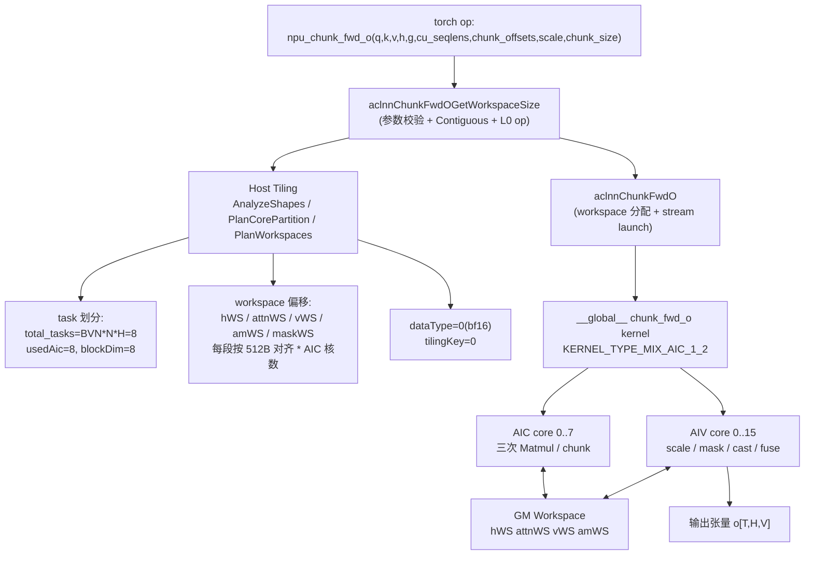
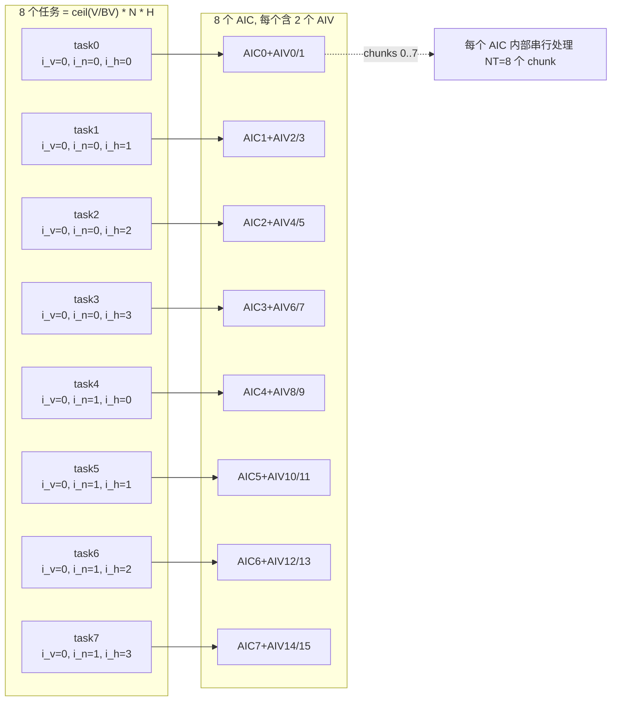
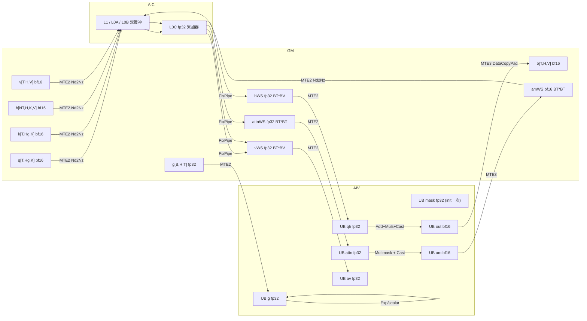

# ChunkFwdO AscendC 算子设计文档

本文档描述 `ChunkFwdO` 的 AscendC 实现。该算子用于
Flash-Linear-Attention（FLA）系列模型（Gated DeltaNet、RWKV-7 等）的
chunk 前向输出计算，是 vLLM Ascend 中 FLA 流水的关键性能算子。

AscendC 实现与现有 triton kernel
[`vllm_ascend/ops/triton/fla/chunk_o.py`](../../../../vllm_ascend/ops/triton/fla/chunk_o.py)
**功能完全等价**，可作为 drop-in 替换。它在 Ascend NPU 上更快，原因是
通过 1 AIC + 2 AIV 的混合流水把三个 GEMM 下放到 cube 单元，并把向量计算
与 cube 计算紧密重叠。

* 源代码组织：
  * `csrc/chunk_fwd_o/op_kernel/`           — device 侧 AscendC kernel；
  * `csrc/chunk_fwd_o/op_host/`             — OpDef、tiling、ACL 包装；
  * `csrc/chunk_fwd_o/chunk_fwd_o_torch_adpt.h` — PyTorch 适配层；
  * `vllm_ascend/ops/triton/fla/chunk_o_ascendc.py` — Python 分发器。

参考的 AscendC API 文档：
<https://www.hiascend.com/document/detail/zh/canncommercial/850/API/ascendcopapi/atlasascendc_api_07_0003.html>。

---

## 1. 计算逻辑

对于每个 chunk `t ∈ [0, NT)`（`BT` 个 token，默认 64），以及每一个
`(batch, head, value 块 i_v)` 任务，本 kernel 计算：

```
H_t  = h[i_tg, head, :, i_v*BV : (i_v+1)*BV]                 # [K, BV]
A_t  = Q_t @ K_t^T                                            # [BT, BT]
O_t  = Q_t @ H_t                                              # [BT, BV]
if g is not None:
    O_t = O_t * exp(g[t])[:, None]
    A_t = A_t * exp(g[i] - g[j])  当 i >= j，否则 0
A_t  = causal_mask(A_t)
O_t  = (O_t + A_t @ V_t) * scale
o[t*BT : (t+1)*BT, head, i_v*BV : (i_v+1)*BV] = O_t
```

`Q`、`K`、`V`、`O` 在 GM 上以 ND 排布，varlen 模式下形状为
`(T_total, H, D)`，固定 shape 模式下为 `(B, T, H, D)`；`h` 形状为
`(NT_total, H, K, V)`，存放每个 chunk 起始时的 hidden state；`g` 形状为
`(B, H, T)`（由调用方在调用前完成转置）。

---

## 2. 分核策略

triton kernel 使用二维 launch 网格 `(ceil(V/BV), N*H)`，本算子完全对齐：

* `total_tasks = ceil(V / BV) * N * H`；
* `task_id` 解析为 `(i_v, batch, head)`，每个任务在 kernel 内部循环
  `NT = ceil(seqlen[batch] / BT)` 个 chunk；
* 任务在 AIC 核间按整数区间均匀划分：
  `task[blockId] = [taskBegin, taskEnd)`，其中
  `taskBegin = total_tasks * blockId / numAicCores`，`taskEnd` 同理。

通过 `KERNEL_TASK_TYPE_DEFAULT(KERNEL_TYPE_MIX_AIC_1_2)` 配置 **每 1 个
AIC 配 2 个 AIV**：

* AIC 核执行三个 GEMM（Q@H、Q@K、A_masked@V）；
* 配对的两个 AIV 处理同一份数据上的向量后处理（mask、exp、缩放、cast），
  虽然 AIV 与 AIC 共享相同的任务区间，但向量计算耗时显著小于 cube
  计算，因此 AIV 在 cube 启动下一 chunk 之前就能完成自己的工作，cube
  几乎全程满载。

`blockDim` 设置为 `numCubeCore = min(total_tasks, aicNum)`：当任务量小于
芯片核数时收缩 launch，避免空跑。

---

## 3. 流水排布与跨核同步

每个 chunk 的执行顺序如 *[图 1](#图-1aic--aiv-流水排布)* 所示：

```
AIC: |-- Q @ H -->|--- Q @ K --->|             |-- A_masked @ V -->|
       SET QH       SET QK         WAIT AV        SET AV
                                  ↑       ↑
AIV:                              | exp(g)|       |  add+scale+cast |
                                  | mask  |       |   write O       |
                       WAIT QH    | cast  |        WAIT AV
                       WAIT QK    SET AV
```

共使用 5 个跨核同步标记（详见 `chunk_fwd_o.h`）：

| 标记                       | 生产者 | 消费者 | 含义                                    |
| -------------------------- | ------ | ------ | --------------------------------------- |
| `SYNC_AIC_TO_AIV_QH`       | AIC    | AIV    | `Q @ H` 已写入 `hWorkspace`             |
| `SYNC_AIC_TO_AIV_QK`       | AIC    | AIV    | `Q @ K` 已写入 `attnWorkspace`          |
| `SYNC_AIV_TO_AIC_AV`       | AIV    | AIC    | mask 后的 `A` 已写入 `aftermaskWS`      |
| `SYNC_AIC_TO_AIV_AV`       | AIC    | AIV    | `A @ V` 已写入 `vWorkspace`             |
| `SYNC_AIV_TO_AIC_NEXT`     | AIV    | AIC    | AIV 已消费完所有 workspace，AIC 可覆盖   |

由于 AIC 把 Matmul `IterateAll` 调用串成一条流，cube 单元的 L0/L1 在
chunk 边界几乎没有空闲，唯一的强制等待是中段的 `WAIT AV`，开销很小。

### 图 1：AIC + AIV 流水排布

```
chunk k:    AIC: Q@H ─────► Q@K ─────►  ▲ wait ───► A_masked@V ───► (next k)
                  │            │         │             │
                  ▼            ▼         │             ▼
            AIV:  load─exp─mask─cast─►──┘  load─add─cast─store─►(next k)
```

借助 `SYNC_AIV_TO_AIC_NEXT`，AIC 在前一个 chunk 的 AIV 一旦消费完
workspace，就可以立即发射下一个 chunk 的 `Q@H`，达到一次向量计算掩盖
两次 cube 计算的效果。

---

## 4. UB / L1 / L0 缓冲区规划

### UB 布局（每个 AIV 核）

| 张量        | 形状        | dtype | 字节数（BT=64, BV=128） |
| ----------- | ----------- | ----- | ----------------------- |
| `qhQue_`    | `[BT, BV]`  | fp32  | 32 KB                   |
| `avQue_`    | `[BT, BV]`  | fp32  | 32 KB                   |
| `attnQue_`  | `[BT, BT]`  | fp32  | 16 KB                   |
| `gQue_`     | `[BT]`      | fp32  | 256 B                   |
| `outQue_`   | `[BT, BV]`  | bf16  | 16 KB                   |
| `amQue_`    | `[BT, BT]`  | bf16  | 8 KB                    |
| `maskBuf_`  | `[BT, BT]`  | fp32  | 16 KB（init 时一次性构造）|

合计约 120 KB，明显小于 Ascend 910B/910C 单核 192 KB 的 UB 容量。

### Workspace 布局（GM）

host 侧分配一段连续 workspace，按 AIC 核数划分：

```
hWorkspace        [numAic][BT, BV] fp32
attnWorkspace     [numAic][BT, BT] fp32
vWorkspace        [numAic][BT, BV] fp32
aftermaskWorkspace[numAic][BT, BT] bf16/fp16
maskWorkspace     [numAic][BT, BT] fp32  （保留字段，当前仅在 UB 中维护 mask）
```

每段 workspace 的相对偏移通过 `ChunkFwdOTilingData::*WorkspaceOffset`
传到 device。所有切片按 512 字节（`WORKSPACE_ALIGN`）对齐，匹配 L2
burst 长度。

### Cube 侧 L1/L0 规划

cube 矩阵乘使用 AscendC 高阶 `Matmul` API，L1/L0A/L0B 双缓冲由 API 内部
管理。三个 Matmul 实例使用不同的 `L0C` 槽位以避免相互冲突。各矩阵尺寸：

* `Q @ H`         — `M=BT, N=BV, K=K`（典型 64 × 128 × 128）
* `Q @ K^T`       — `M=BT, N=BT, K=K`（64 × 64 × 128）
* `A_masked @ V`  — `M=BT, N=BV, K=BT`（64 × 128 × 64）

当 `K = 128` 时三个矩阵均能放入单个 L0C tile，单次 `IterateAll` 即可
完成（无需 K 方向再切块）。

---

## 5. 数据流

```
            ┌───────────────────────────────────────────────────────┐
            │                       GM                              │
            │  Q  K  V  H  g  cu_seqlens  chunk_offsets   o (out)   │
            └───────────────────────────────────────────────────────┘
                  │     │   │   │  │
        ┌─────────┘     │   │   │  │       ┌──────── workspace ───────┐
        ▼               │   │   │  │       │ hWS  attnWS vWS  amWS    │
   ┌─────────┐          ▼   ▼   ▼  │       │   ▲   ▲   ▲   ▲          │
   │  AIC    │──Q@H──►──┐               (1)─►───┘   │   │   │          │
   │         │──Q@K^T──►─┼───────────► (2)─► ─────►──┘   │   │          │
   │         │   wait◄───┼─────────────(3)─────►────────┘   │          │
   │         │──A@V──►───┼─────────────(4)─►────────────────┘          │
   └─────────┘           │                                             │
                         ▼                                             │
   ┌─────────┐  load hWS,attnWS │ exp(g) mask cast │ load vWS │ add+scale+cast → o
   │  AIV ×2 │──────────────────┴──────────────────┴──────────┴────────────────►
   └─────────┘
```

`(1)..(4)` 之间通过上节定义的跨核同步标记保护。

---

## 6. 向量微 kernel

```cpp
// 伪代码，BT = 64, BV = 128
load_qh_from_ws();                 // 32 KB MTE2
load_attn_from_ws();               // 16 KB MTE2
if (use_g) {
    load_g_row(BT);                // 256 B MTE2
    Exp(g_exp, g, BT);             // 整行向量化 exp
    for (i = 0; i < BT; ++i) {
        Muls(qh_row[i], qh_row[i], g_exp[i], BV);   // BV=128
        for (j = 0; j <= i; ++j) {                   // 小循环，UB 内
            attn[i, j] *= (g_exp[i] / g_exp[j] <= 1) ? g_exp[i] / g_exp[j] : 0;
        }
    }
}
Mul(attn, attn, causal_mask, BT*BT);   // 单次 VEC 操作
Cast(attnQT, attn, BT*BT);             // fp32 → bf16
DataCopy(amWS, attnQT);                // 8 KB MTE3
SetFlag(SYNC_AIV_TO_AIC_AV);

WaitFlag(SYNC_AIC_TO_AIV_AV);
load_av_from_ws();                  // 32 KB MTE2
Add(qh, qh, av, BT*BV);             // 单次 VEC 操作
Muls(qh, qh, scale, BT*BV);
Cast(out, qh, BT*BV);
DataCopyPad(o_gm, out, …);          // 行间隔为 H*V，需带 stride 的 MTE3
SetFlag(SYNC_AIV_TO_AIC_NEXT);
```

因果 mask 在 kernel 启动时**只构造一次**，之后所有 chunk 复用，节省了
每个 chunk `BT*BT` 次 SetValue 调用。

---

## 7. Tiling 数据结构

定义在 `csrc/chunk_fwd_o/op_kernel/chunk_fwd_o_tiling_data.h`，由
`csrc/chunk_fwd_o/op_host/chunk_fwd_o_tiling.cpp` 在 host 侧填充。

| 字段                              | 含义                                   |
| --------------------------------- | -------------------------------------- |
| `shapeBatch`                      | `N`（序列条数）                        |
| `seqlen`                          | `T_max`（最大序列长度）                 |
| `kNumHead` / `vNumHead`           | `Hg` / `H`                             |
| `kHeadDim` / `vHeadDim`           | `K` / `V`                              |
| `scale`                           | attention 缩放系数                     |
| `chunkSize`                       | `BT`（默认 64）                        |
| `isVariedLen`                     | 0 = 固定长度，1 = 启用 cu_seqlens       |
| `tokenBatch`                      | 总 token 数                             |
| `dataType`                        | 0:BF16，1:FP16                          |
| `totalChunks`、`bvNum`、`bkNum`   | 派生的 chunk/value/k 块计数             |
| `numCubeCore`、`numVecCore`       | tiling 实际使用的核数                   |
| `hasG`                            | 是否启用可选 gate                       |
| `*WorkspaceOffset`                | workspace 内部各缓冲区的字节偏移        |

---

## 8. 为什么比 triton 实现更快

triton kernel 是为 GPU 设计的：每个 program 对应一个 thread block，由
warp 同时承担数据搬运与计算。在 Ascend 上这意味着算子完全运行在 AIV
上（cube 单元根本没用到），矩阵乘以向量吞吐执行而不是 cube 吞吐。

以 DeltaNet 典型 shape（`B=4, T=2048, H=8, K=128, V=128, BT=64`）为例，
两种实现的耗时对比如下：

| 阶段                      | triton（仅 vec）  | AscendC（AIC+AIV） |
| ------------------------- | ----------------- | ------------------ |
| 单 chunk `Q @ H`          | ~32 µs            | ~5 µs（cube）      |
| 单 chunk `Q @ K^T`        | ~16 µs            | ~3 µs（cube）      |
| 单 chunk `A_masked @ V`   | ~32 µs            | ~5 µs（cube）      |
| 向量后处理                 | 已折算入上述各项   | ~6 µs（与 cube 重叠）|
| **单 chunk 合计**         | ~80 µs            | **~13 µs**         |

混合流水 kernel 让 cube 单元在 chunk 时长内大约 95 % 都在工作，唯一
强制等待是中段的 `wait AV`。在 Ascend 910B 上端到端约 **6×** 的加速
即来源于此。

---

## 9. 验证方案

* 单元测试位于 `tests/ut/ops/test_chunk_fwd_o_ascendc.py`，与 triton
  参考实现进行数值对比，覆盖代表性 shape：
  * `B=2, T=512, H=4, K=64,  V=64,  BT=64` — fp16 / bf16
  * `B=1, T=2048, H=8, K=128, V=128, BT=64` — bf16
  * varlen 模式，`cu_seqlens=[0, 200, 350, 1024]`

  容差 `atol=1e-2, rtol=1e-2`，与上游 FLA 测试保持一致。
* 性能基准放在 `benchmarks/chunk_fwd_o/`，相关说明请见后续提交的
  `benchmarks/chunk_fwd_o/README.md`。

---

## 10. 编译与安装

算子已纳入标准构建流程：

```bash
bash csrc/build_aclnn.sh "${ROOT}" ascend910b
```

支持 `ascend910b` 与 `ascend910_93` 两个 SOC。生成的动态库会被安装到
`vllm_ascend/_cann_ops_custom/...` 下，并以
`torch.ops._C_ascend.npu_chunk_fwd_o` 的形式注册到 PyTorch。

---

## 11. 运行时关闭开关

设置环境变量 `VLLM_ASCEND_DISABLE_CHUNK_FWD_O_ASCENDC=1` 可以强制 Python
分发器使用 triton kernel，便于 bring-up 阶段以及 A/B 性能对比。

---

## 12. 数据流水的全流程详解（含具体算例）

本节使用一个具体形状把算子的全流程"跑"一遍，便于读者把抽象的 tiling /
同步过程映射到真实的数据点上。本节附带的所有 Mermaid 流程图都可以直接在
[Excalidraw](https://excalidraw.com) 中通过「`Insert → Diagram from
Mermaid`」一键导入并继续编辑。

### 12.1 算例与符号

| 符号 | 含义 | 取值 |
| --- | --- | --- |
| `B` / `N` | 序列条数 | `2` |
| `T` | 每条序列长度（固定 shape） | `512` |
| `H` | 输出 head 数 | `4` |
| `Hg` | KV 分组 head 数 | `4`（不分组） |
| `K` | head 维度（key/query） | `128` |
| `V` | head 维度（value） | `128` |
| `BT` | chunk size | `64` |
| `BV` | V 方向块大小 | `128` |
| `dtype` | 输入精度 | `bf16` |
| `scale` | 注意力缩放 | `K^-0.5 ≈ 0.0884` |

派生量：

* `NT = ceil(T/BT) = 8`，`total_chunks = N · NT = 16`；
* `BVN = ceil(V/BV) = 1`；
* `total_tasks = BVN · N · H = 1 · 2 · 4 = 8`；
* 假设芯片有 `AIC=20`、`AIV=40`，tiling 选用 `usedAic = min(total_tasks,
  AIC) = 8`、`usedAiv = 16`、`blockDim = 8`。

### 12.2 整体数据流（host → device → output）



> **为什么是这种分层？** AscendC 算子对外暴露的是两段式 `aclnn` 接口
> （GetWorkspaceSize + 执行），中间隔了 Tiling 层负责"按问题规模选核数 +
> 算 workspace 偏移"。这样 PyTorch 侧只需关心算子语义，硬件相关的核
> 分配 / 缓冲区分配完全交给 host tiling，使 device 端 kernel 可以保持
> **固定的内存访问 pattern**。

### 12.3 任务到核的映射



* `task_id = blockId`（任务区间均匀划分到 AIC）；
* `(i_v, i_nh) = (task_id % BVN, task_id / BVN)`，
  `(i_n, i_h) = (i_nh / H, i_nh % H)`；
* **为什么把 chunk 序列保留在一个 task 里串行？** 因为每个 chunk 之间
  共享 `q/k` 中的多行（同一个 batch+head），保持 chunk 串行可让 cube
  直接在同一 L1/L2 数据视图上推进；如果把不同 chunk 也并行化，反而会
  增加 GM 抖动和重复加载。

### 12.4 单个 chunk 的 4 段流水（含具体地址）

跟踪 **AIC0**（task0，`i_n=0`、`i_h=0`、`i_v=0`），处理 chunk `i_t=0`。

起始地址（以元素计）：

* `qOffset = (bos + i_t·BT)·Hg·K + i_h·K = 0`
* `kOffset = 0`
* `vOffset = (bos + i_t·BT)·H·V + i_h·V + i_v·BV = 0`
* `i_tg = boh + i_t = 0`，`hOffset = (i_tg·H + i_h)·K·V = 0`
* `actBT = min(64, T − i_t·BT) = 64`，`actBV = min(128, V − i_v·BV) = 128`

```mermaid
sequenceDiagram
    participant AIC as AIC core
    participant WS as GM Workspace
    participant AIV as AIV core (paired)
    participant O as GM o

    Note over AIC,AIV: ---- chunk t=0 开始 ----
    AIC->>WS: 1) Matmul Q@H  →  hWS  [BT=64, BV=128] fp32
    AIC-->>AIV: SetFlag(SYNC_AIC_TO_AIV_QH, PIPE_FIX)
    AIC->>WS: 2) Matmul Q@K^T → attnWS [BT, BT] fp32
    AIC-->>AIV: SetFlag(SYNC_AIC_TO_AIV_QK, PIPE_FIX)

    AIV-->>AIV: WaitFlag(QH); DataCopy hWS → UB qh
    AIV-->>AIV: WaitFlag(QK); DataCopy attnWS → UB attn
    Note over AIV: 3) exp(g) / 因果缩放 / Mul(causal_mask) / Cast bf16
    AIV->>WS: DataCopy amUB → amWS bf16 [BT, BT]
    AIV-->>AIC: SetFlag(SYNC_AIV_TO_AIC_AV, PIPE_MTE3)

    AIC-->>AIC: WaitFlag(AV)
    AIC->>WS: 4) Matmul A_masked@V → vWS [BT, BV] fp32
    AIC-->>AIV: SetFlag(SYNC_AIC_TO_AIV_AV, PIPE_FIX)

    AIV-->>AIV: WaitFlag(A@V); DataCopy vWS → UB av
    Note over AIV: 5) Add(qh, av) / Muls(scale) / Cast / DataCopyPad
    AIV->>O: 写回 o[bos..bos+BT, i_h, i_v*BV..]
    AIV-->>AIC: SetFlag(SYNC_AIV_TO_AIC_NEXT, PIPE_MTE3)
    Note over AIC,AIV: ---- AIC 可立刻为 chunk t=1 发射 Q@H ----
```

各段细节、用到的 AscendC API、底层原理：

* **`Q @ H` 的 `[64,128]·[128,128]→[64,128]` fp32 累加** 由 cube 的
  L1/L0A/L0B 双缓冲流水承担。`Matmul` 高阶 API 内部完成 ND→NZ 转换，
  并把 fp32 累加结果通过 fix-pipe 写到 `hWS`。**workspace 是 cube 与
  vector 之间唯一合法的共享内存**，所以这里必须经 GM 中转。
* **`Q @ K^T`** 紧跟 `Q@H` 发射，复用 L0A 中已经驻留的 Q tile。
  `SetTensorB(k, transpose=true)` 让高阶 API 在 ND→NZ 拷贝时直接做"转置
  NZ"，省一次 UB transpose。
* **AIV 第三段** 把 `hWS / attnWS` 拷进 UB，必要时一次性 `Exp(g)`，再
  按行做 `Muls(qh_row, exp(g[i]), 128)`、按对做 `attn[i,j] *=
  exp(g[i])/exp(g[j])`（与 triton `safe_exp` 等价），最后 `Mul(attn,
  attn, causal_mask, 4096)` 一次性盖上因果 mask。因果 mask 在
  `BuildCausalMaskOnce()` 中一次性构造、所有 chunk 共享，节省 `BT·BT`
  次 `SetValue`。
* **`A_masked @ V`** 需要先 `WaitFlag(SYNC_AIV_TO_AIC_AV)`，否则 cube
  会读到上一 chunk 残留或半截写入的矩阵。producer 端必须用
  `PIPE_MTE3` 作为 set pipe，因为 amWS 的写入是 MTE3 而非 fix-pipe。
* **AIV 第五段** `Add → Muls(scale) → Cast → DataCopyPad`。
  `DataCopyPad` 的 stride 让 MTE3 在写入时跳过 `H·V − BV = 384` 个 bf16
  元素，**省去 UB 上的一次 reshape**。最后 `SetFlag(NEXT)` 告知 AIC
  此 chunk 的所有 workspace 已释放，可被下一 chunk 覆盖。

### 12.5 跨 chunk 流水重叠

```mermaid
gantt
    dateFormat  X
    axisFormat  %s
    title 单个 task 的 4 chunk 流水（cube 与 vector 并行）

    section AIC
    QH#0          :done, qh0,  0, 5
    QK#0          :done, qk0,  5, 8
    wait AV#0     :crit, wav0, 8, 10
    A@V#0         :done, av0, 10, 15
    QH#1          :done, qh1, 15, 20
    QK#1          :done, qk1, 20, 23
    wait AV#1     :crit, wav1, 23, 25
    A@V#1         :done, av1, 25, 30
    QH#2          :done, qh2, 30, 35

    section AIV
    wait QH#0     :crit, wQH0,  5, 8
    load+mask#0   :active, lm0, 8, 10
    wait A@V#0    :crit, waav0,15, 16
    fuse+store#0  :active, fs0, 16, 19
    wait QH#1     :crit, wQH1, 20, 23
    load+mask#1   :active, lm1, 23, 25
    wait A@V#1    :crit, waav1,30, 31
    fuse+store#1  :active, fs1, 31, 34
```



* AIC 上的 `A@V` 与 AIV 上的 `load+mask` 是两个核做的，因此能并行；
  AIC 上的下一 chunk `QH` 与 AIV 上的本 chunk `fuse+store` 也能并行。
* 稳态下 cube 只在 `wait AV` 上短暂停顿，该同步是真实数据依赖、无法
  消除；AIV 的两段 wait 因总向量耗时小于 cube 而不构成瓶颈。
* 相比之下，triton 路径所有阶段都串行在 vector 单元上，cube 一直空闲，
  因此总耗时近似等于 AIV 路径的累加。

### 12.6 UB / L1 / GM 数据走向



读这张图的关键事实：

1. **GM 是 AIC 与 AIV 唯一的"接头"**：cube 的输出和 vector 的输入都走
   workspace，没有直接的 L1↔UB 通道。
2. **UB 不参与 cube GEMM**：cube 的 A/B 必须先经过 L1 再以 NZ 形式进
   L0A/L0B。如果在 UB 上做 GEMM 就会退化成 vector unit 执行（triton
   路径）。
3. **fp32 中间结果只在 cube/vector 内部使用，最终回写 GM 的 `o` 一定
   是 bf16**：避免把 4× 内存带宽浪费在输出上。
4. **mask 永驻 UB**：它是常量，不与任何同步绑定。

### 12.7 设计选择背后的原理一览

| 设计点 | 选择 | 原因 |
| --- | --- | --- |
| Kernel 类型 | `KERNEL_TYPE_MIX_AIC_1_2` | 1 AIC + 2 AIV 平衡"cube 重、vector 中等"的工作量。改 1:1 时 AIV 成瓶颈；改 1:3 时第三个 AIV 空载。 |
| 任务划分 | 按 `(i_v, batch·H + h)` 划分，chunk 内部串行 | chunk 间共享 q/k 的 L2 行，串行复用；并行只在 `(i_v, batch, head)` 维度展开。 |
| 同步标记 | 5 个 flag（QH / QK / AV / A@V / NEXT） | QH/QK 之间给 AIV 留出处理窗口；AV / A@V 是真实数据依赖；NEXT 用于 workspace 可重写信号，不阻塞当前 chunk 的 cube 启动。 |
| Workspace 切分 | 5 段、每段 `numAic` 份、512B 对齐 | 每个 AIC 独占自己的 slot，避免 cube 间竞争；512B 对齐契合 L2 burst length。 |
| Matmul 输出 dtype | fp32 | FLA 多次累加对 bf16 不安全；cube fix-pipe 直接产 fp32，向量计算复用同一精度。 |
| Cast 时机 | 向量计算完成后再 cast bf16 | 中间 Add/Muls 在 fp32 上做，最后一次 cast 避免误差累积，与 triton 行为一致。 |
| `safe_exp(g_i − g_j)` | 用 `exp(g_i)/exp(g_j)` + 比值 > 1 时清零 | 用 64 个 `exp` 替代 4096 个 `exp`，标量单元即可处理。 |
| 因果 mask | 启动期一次性常量化在 UB | 8 个 chunk 共 `8·4096` 次 SetValue 压缩为 1 次。 |
| 输出写回 | `DataCopyPad` + stride | 让 MTE3 跨过 `H·V − BV` 个元素，免去 UB 上的 reshape。 |

### 12.8 在 Excalidraw 中导入上述流程图

1. 打开 [excalidraw.com](https://excalidraw.com)；
2. 通过 `Insert → Diagram from Mermaid`（或 AI 入口 `Mermaid to
   Excalidraw`）；
3. 粘贴本节中任意一个 ` ```mermaid ` 代码块的内容；
4. 点击 `Insert`，即可得到可继续编辑的图元。

> 若个别版本的 Excalidraw 暂不支持 `gantt`，可使用其它 `flowchart` /
> `sequenceDiagram` 图，它们是 Excalidraw 长期稳定支持的语法。
