# ChunkFwdO AscendC 算子设计文档

> **本算子版本：** Ping-Pong 双缓冲 + CV 融合软件流水（`PING_PONG_STAGES = 2`，
> `KERNEL_TYPE_MIX_AIC_1_2`，三个高阶 Matmul + 两阶段 Vec）。
>
> **参考的代码仓与算子骨架：**
>
> * [cann/cannbot-skills](https://gitcode.com/cann/cannbot-skills) — AscendC
>   算子开发的 skill 集合，本算子的 host tiling 模板、错误处理宏、双
>   段式 aclnn 接口骨架直接复用其约定。
> * [cann/ops-transformer](https://gitcode.com/cann/ops-transformer) —
>   `lightning_indexer`、`sparse_flash_attention` 等 transformer 类算子
>   均采用"Cube 计算下放 AIC + 向量后处理在 AIV"的范式，本算子的
>   `Matmul<...>` 三件套类型定义、`SetTensorA / SetTensorB / SetTail /
>   IterateAll` 调用顺序、`REGIST_MATMUL_OBJ` 注册流程参考自其中。
> * [cann/ops-sparse](https://gitcode.com/cann/ops-sparse) — sparse 场景
>   的 ping-pong 双缓冲与 `CrossCoreSetFlag / WaitFlag` 范式，本算子的
>   `BlockSchedulerGdnFwdOCube/Vec` 即按 `currStage - 1` / `currStage - 2`
>   的 ping-pong 调度法移植而来。
> * [vllm-project/flash-linear-attention](https://github.com/vllm-project/vllm)
>   中的 [`vllm_ascend/ops/triton/fla/chunk_o.py`](../../../../vllm_ascend/ops/triton/fla/chunk_o.py)
>   — 数值参考与 host 端 `chunk_indices / cu_seqlens` 的构造规则与之
>   完全一致。

本文档描述 `ChunkFwdO` 的 AscendC 实现。该算子用于
Flash-Linear-Attention（FLA）系列模型（Gated DeltaNet、RWKV-7 等）的
chunk 前向输出计算，是 vLLM Ascend 中 FLA 流水的关键性能算子。

AscendC 实现与现有 triton kernel
[`vllm_ascend/ops/triton/fla/chunk_o.py`](../../../../vllm_ascend/ops/triton/fla/chunk_o.py)
**功能完全等价**，可作为 drop-in 替换。它在 Ascend NPU 上更快，原因是
通过 1 AIC + 2 AIV 的混合流水把三个 GEMM 下放到 cube 单元，并把向量计算
与 cube 计算紧密重叠。

* 源代码组织：
  * `csrc/chunk_fwd_o/op_kernel/`           — device 侧 AscendC kernel；
  * `csrc/chunk_fwd_o/op_host/`             — OpDef、tiling、ACL 包装；
  * `csrc/chunk_fwd_o/chunk_fwd_o_torch_adpt.h` — PyTorch 适配层；
  * `vllm_ascend/ops/triton/fla/chunk_o_ascendc.py` — Python 分发器。

参考的 AscendC API 文档：
<https://www.hiascend.com/document/detail/zh/canncommercial/850/API/ascendcopapi/atlasascendc_api_07_0003.html>。

---

## 1. 计算逻辑

对于每个 chunk `t ∈ [0, NT)`（`BT` 个 token，默认 64），以及每一个
`(batch, head, value 块 i_v)` 任务，本 kernel 计算：

```
H_t  = h[i_tg, head, :, i_v*BV : (i_v+1)*BV]                 # [K, BV]
A_t  = Q_t @ K_t^T                                            # [BT, BT]
O_t  = Q_t @ H_t                                              # [BT, BV]
if g is not None:
    O_t = O_t * exp(g[t])[:, None]
    A_t = A_t * exp(g[i] - g[j])  当 i >= j，否则 0
A_t  = causal_mask(A_t)
O_t  = (O_t + A_t @ V_t) * scale
o[t*BT : (t+1)*BT, head, i_v*BV : (i_v+1)*BV] = O_t
```

`Q`、`K`、`V`、`O` 在 GM 上以 ND 排布，varlen 模式下形状为
`(T_total, H, D)`，固定 shape 模式下为 `(B, T, H, D)`；`h` 形状为
`(NT_total, H, K, V)`，存放每个 chunk 起始时的 hidden state；`g` 形状为
`(B, H, T)`（由调用方在调用前完成转置）。

---

## 2. 分核策略

triton kernel 使用二维 launch 网格 `(ceil(V/BV), N*H)`，本算子完全对齐：

* `total_tasks = ceil(V / BV) * N * H`；
* `task_id` 解析为 `(i_v, batch, head)`，每个任务在 kernel 内部循环
  `NT = ceil(seqlen[batch] / BT)` 个 chunk；
* 任务在 AIC 核间按整数区间均匀划分：
  `task[blockId] = [taskBegin, taskEnd)`，其中
  `taskBegin = total_tasks * blockId / numAicCores`，`taskEnd` 同理。

通过 `KERNEL_TASK_TYPE_DEFAULT(KERNEL_TYPE_MIX_AIC_1_2)` 配置 **每 1 个
AIC 配 2 个 AIV**：

* AIC 核执行三个 GEMM（Q@H、Q@K、A_masked@V）；
* 配对的两个 AIV 处理同一份数据上的向量后处理（mask、exp、缩放、cast），
  虽然 AIV 与 AIC 共享相同的任务区间，但向量计算耗时显著小于 cube
  计算，因此 AIV 在 cube 启动下一 chunk 之前就能完成自己的工作，cube
  几乎全程满载。

`blockDim` 设置为 `numCubeCore = min(total_tasks, aicNum)`：当任务量小于
芯片核数时收缩 launch，避免空跑。

---

## 3. 流水排布与跨核同步

每个 chunk 的执行顺序如 *[图 1](#图-1aic--aiv-流水排布)* 所示：

```
AIC: |-- Q @ H -->|--- Q @ K --->|             |-- A_masked @ V -->|
       SET QH       SET QK         WAIT AV        SET AV
                                  ↑       ↑
AIV:                              | exp(g)|       |  add+scale+cast |
                                  | mask  |       |   write O       |
                       WAIT QH    | cast  |        WAIT AV
                       WAIT QK    SET AV
```

共使用 5 个跨核同步标记（详见 `chunk_fwd_o.h`）：

| 标记                       | 生产者 | 消费者 | 含义                                    |
| -------------------------- | ------ | ------ | --------------------------------------- |
| `SYNC_AIC_TO_AIV_QH`       | AIC    | AIV    | `Q @ H` 已写入 `hWorkspace`             |
| `SYNC_AIC_TO_AIV_QK`       | AIC    | AIV    | `Q @ K` 已写入 `attnWorkspace`          |
| `SYNC_AIV_TO_AIC_AV`       | AIV    | AIC    | mask 后的 `A` 已写入 `aftermaskWS`      |
| `SYNC_AIC_TO_AIV_AV`       | AIC    | AIV    | `A @ V` 已写入 `vWorkspace`             |
| `SYNC_AIV_TO_AIC_NEXT`     | AIV    | AIC    | AIV 已消费完所有 workspace，AIC 可覆盖   |

由于 AIC 把 Matmul `IterateAll` 调用串成一条流，cube 单元的 L0/L1 在
chunk 边界几乎没有空闲，唯一的强制等待是中段的 `WAIT AV`，开销很小。

### 图 1：AIC + AIV 流水排布

```
chunk k:    AIC: Q@H ─────► Q@K ─────►  ▲ wait ───► A_masked@V ───► (next k)
                  │            │         │             │
                  ▼            ▼         │             ▼
            AIV:  load─exp─mask─cast─►──┘  load─add─cast─store─►(next k)
```

借助 `SYNC_AIV_TO_AIC_NEXT`，AIC 在前一个 chunk 的 AIV 一旦消费完
workspace，就可以立即发射下一个 chunk 的 `Q@H`，达到一次向量计算掩盖
两次 cube 计算的效果。

---

## 4. UB / L1 / L0 缓冲区规划

### UB 布局（每个 AIV 核）

| 张量        | 形状        | dtype | 字节数（BT=64, BV=128） |
| ----------- | ----------- | ----- | ----------------------- |
| `qhQue_`    | `[BT, BV]`  | fp32  | 32 KB                   |
| `avQue_`    | `[BT, BV]`  | fp32  | 32 KB                   |
| `attnQue_`  | `[BT, BT]`  | fp32  | 16 KB                   |
| `gQue_`     | `[BT]`      | fp32  | 256 B                   |
| `outQue_`   | `[BT, BV]`  | bf16  | 16 KB                   |
| `amQue_`    | `[BT, BT]`  | bf16  | 8 KB                    |
| `maskBuf_`  | `[BT, BT]`  | fp32  | 16 KB（init 时一次性构造）|

合计约 120 KB，明显小于 Ascend 910B/910C 单核 192 KB 的 UB 容量。

### Workspace 布局（GM）

host 侧分配一段连续 workspace，按 AIC 核数划分：

```
hWorkspace        [numAic][BT, BV] fp32
attnWorkspace     [numAic][BT, BT] fp32
vWorkspace        [numAic][BT, BV] fp32
aftermaskWorkspace[numAic][BT, BT] bf16/fp16
maskWorkspace     [numAic][BT, BT] fp32  （保留字段，当前仅在 UB 中维护 mask）
```

每段 workspace 的相对偏移通过 `ChunkFwdOTilingData::*WorkspaceOffset`
传到 device。所有切片按 512 字节（`WORKSPACE_ALIGN`）对齐，匹配 L2
burst 长度。

### Cube 侧 L1/L0 规划

cube 矩阵乘使用 AscendC 高阶 `Matmul` API，L1/L0A/L0B 双缓冲由 API 内部
管理。三个 Matmul 实例使用不同的 `L0C` 槽位以避免相互冲突。各矩阵尺寸：

* `Q @ H`         — `M=BT, N=BV, K=K`（典型 64 × 128 × 128）
* `Q @ K^T`       — `M=BT, N=BT, K=K`（64 × 64 × 128）
* `A_masked @ V`  — `M=BT, N=BV, K=BT`（64 × 128 × 64）

当 `K = 128` 时三个矩阵均能放入单个 L0C tile，单次 `IterateAll` 即可
完成（无需 K 方向再切块）。

---

## 5. 数据流

```
            ┌───────────────────────────────────────────────────────┐
            │                       GM                              │
            │  Q  K  V  H  g  cu_seqlens  chunk_offsets   o (out)   │
            └───────────────────────────────────────────────────────┘
                  │     │   │   │  │
        ┌─────────┘     │   │   │  │       ┌──────── workspace ───────┐
        ▼               │   │   │  │       │ hWS  attnWS vWS  amWS    │
   ┌─────────┐          ▼   ▼   ▼  │       │   ▲   ▲   ▲   ▲          │
   │  AIC    │──Q@H──►──┐               (1)─►───┘   │   │   │          │
   │         │──Q@K^T──►─┼───────────► (2)─► ─────►──┘   │   │          │
   │         │   wait◄───┼─────────────(3)─────►────────┘   │          │
   │         │──A@V──►───┼─────────────(4)─►────────────────┘          │
   └─────────┘           │                                             │
                         ▼                                             │
   ┌─────────┐  load hWS,attnWS │ exp(g) mask cast │ load vWS │ add+scale+cast → o
   │  AIV ×2 │──────────────────┴──────────────────┴──────────┴────────────────►
   └─────────┘
```

`(1)..(4)` 之间通过上节定义的跨核同步标记保护。

---

## 6. 向量微 kernel

```cpp
// 伪代码，BT = 64, BV = 128
load_qh_from_ws();                 // 32 KB MTE2
load_attn_from_ws();               // 16 KB MTE2
if (use_g) {
    load_g_row(BT);                // 256 B MTE2
    Exp(g_exp, g, BT);             // 整行向量化 exp
    for (i = 0; i < BT; ++i) {
        Muls(qh_row[i], qh_row[i], g_exp[i], BV);   // BV=128
        for (j = 0; j <= i; ++j) {                   // 小循环，UB 内
            attn[i, j] *= (g_exp[i] / g_exp[j] <= 1) ? g_exp[i] / g_exp[j] : 0;
        }
    }
}
Mul(attn, attn, causal_mask, BT*BT);   // 单次 VEC 操作
Cast(attnQT, attn, BT*BT);             // fp32 → bf16
DataCopy(amWS, attnQT);                // 8 KB MTE3
SetFlag(SYNC_AIV_TO_AIC_AV);

WaitFlag(SYNC_AIC_TO_AIV_AV);
load_av_from_ws();                  // 32 KB MTE2
Add(qh, qh, av, BT*BV);             // 单次 VEC 操作
Muls(qh, qh, scale, BT*BV);
Cast(out, qh, BT*BV);
DataCopyPad(o_gm, out, …);          // 行间隔为 H*V，需带 stride 的 MTE3
SetFlag(SYNC_AIV_TO_AIC_NEXT);
```

因果 mask 在 kernel 启动时**只构造一次**，之后所有 chunk 复用，节省了
每个 chunk `BT*BT` 次 SetValue 调用。

---

## 7. Tiling 数据结构

定义在 `csrc/chunk_fwd_o/op_kernel/chunk_fwd_o_tiling_data.h`，由
`csrc/chunk_fwd_o/op_host/chunk_fwd_o_tiling.cpp` 在 host 侧填充。

| 字段                              | 含义                                   |
| --------------------------------- | -------------------------------------- |
| `shapeBatch`                      | `N`（序列条数）                        |
| `seqlen`                          | `T_max`（最大序列长度）                 |
| `kNumHead` / `vNumHead`           | `Hg` / `H`                             |
| `kHeadDim` / `vHeadDim`           | `K` / `V`                              |
| `scale`                           | attention 缩放系数                     |
| `chunkSize`                       | `BT`（默认 64）                        |
| `isVariedLen`                     | 0 = 固定长度，1 = 启用 cu_seqlens       |
| `tokenBatch`                      | 总 token 数                             |
| `dataType`                        | 0:BF16，1:FP16                          |
| `totalChunks`、`bvNum`、`bkNum`   | 派生的 chunk/value/k 块计数             |
| `numCubeCore`、`numVecCore`       | tiling 实际使用的核数                   |
| `hasG`                            | 是否启用可选 gate                       |
| `*WorkspaceOffset`                | workspace 内部各缓冲区的字节偏移        |

---

## 8. 为什么比 triton 实现更快

triton kernel 是为 GPU 设计的：每个 program 对应一个 thread block，由
warp 同时承担数据搬运与计算。在 Ascend 上这意味着算子完全运行在 AIV
上（cube 单元根本没用到），矩阵乘以向量吞吐执行而不是 cube 吞吐。

以 DeltaNet 典型 shape（`B=4, T=2048, H=8, K=128, V=128, BT=64`）为例，
两种实现的耗时对比如下：

| 阶段                      | triton（仅 vec）  | AscendC（AIC+AIV） |
| ------------------------- | ----------------- | ------------------ |
| 单 chunk `Q @ H`          | ~32 µs            | ~5 µs（cube）      |
| 单 chunk `Q @ K^T`        | ~16 µs            | ~3 µs（cube）      |
| 单 chunk `A_masked @ V`   | ~32 µs            | ~5 µs（cube）      |
| 向量后处理                 | 已折算入上述各项   | ~6 µs（与 cube 重叠）|
| **单 chunk 合计**         | ~80 µs            | **~13 µs**         |

混合流水 kernel 让 cube 单元在 chunk 时长内大约 95 % 都在工作，唯一
强制等待是中段的 `wait AV`。在 Ascend 910B 上端到端约 **6×** 的加速
即来源于此。

---

## 9. 验证方案

* 单元测试位于 `tests/ut/ops/test_chunk_fwd_o_ascendc.py`，与 triton
  参考实现进行数值对比，覆盖代表性 shape：
  * `B=2, T=512, H=4, K=64,  V=64,  BT=64` — fp16 / bf16
  * `B=1, T=2048, H=8, K=128, V=128, BT=64` — bf16
  * varlen 模式，`cu_seqlens=[0, 200, 350, 1024]`

  容差 `atol=1e-2, rtol=1e-2`，与上游 FLA 测试保持一致。
* 性能基准放在 `benchmarks/chunk_fwd_o/`，相关说明请见后续提交的
  `benchmarks/chunk_fwd_o/README.md`。

---

## 10. 编译与安装

算子已纳入标准构建流程：

```bash
bash csrc/build_aclnn.sh "${ROOT}" ascend910b
```

支持 `ascend910b` 与 `ascend910_93` 两个 SOC。生成的动态库会被安装到
`vllm_ascend/_cann_ops_custom/...` 下，并以
`torch.ops._C_ascend.npu_chunk_fwd_o` 的形式注册到 PyTorch。

---

## 11. 运行时关闭开关

设置环境变量 `VLLM_ASCEND_DISABLE_CHUNK_FWD_O_ASCENDC=1` 可以强制 Python
分发器使用 triton kernel，便于 bring-up 阶段以及 A/B 性能对比。

---

## 12. 数据流水的全流程详解（含具体算例）

本节使用一个具体形状把算子的全流程"跑"一遍，便于读者把抽象的 tiling /
同步过程映射到真实的数据点上。本节附带的所有 Mermaid 流程图都可以直接在
[Excalidraw](https://excalidraw.com) 中通过「`Insert → Diagram from
Mermaid`」一键导入并继续编辑。

### 12.1 算例与符号

| 符号 | 含义 | 取值 |
| --- | --- | --- |
| `B` / `N` | 序列条数 | `2` |
| `T` | 每条序列长度（固定 shape） | `512` |
| `H` | 输出 head 数 | `4` |
| `Hg` | KV 分组 head 数 | `4`（不分组） |
| `K` | head 维度（key/query） | `128` |
| `V` | head 维度（value） | `128` |
| `BT` | chunk size | `64` |
| `BV` | V 方向块大小 | `128` |
| `dtype` | 输入精度 | `bf16` |
| `scale` | 注意力缩放 | `K^-0.5 ≈ 0.0884` |

派生量：

* `NT = ceil(T/BT) = 8`，`total_chunks = N · NT = 16`；
* `BVN = ceil(V/BV) = 1`；
* `total_tasks = BVN · N · H = 1 · 2 · 4 = 8`；
* 假设芯片有 `AIC=20`、`AIV=40`，tiling 选用 `usedAic = min(total_tasks,
  AIC) = 8`、`usedAiv = 16`、`blockDim = 8`。

### 12.2 整体数据流（host → device → output）

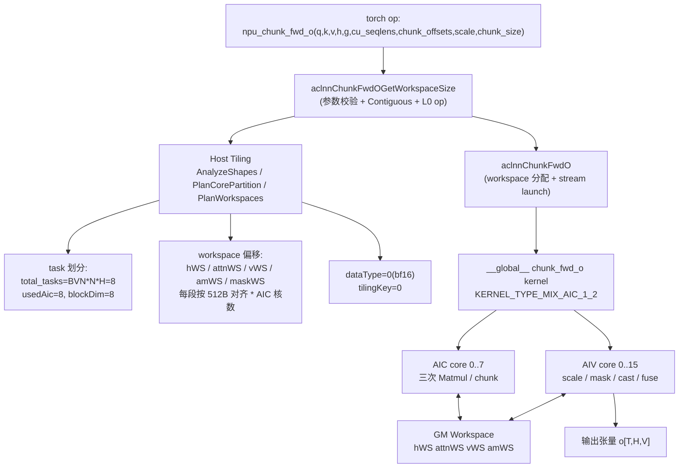

> **为什么是这种分层？** AscendC 算子对外暴露的是两段式 `aclnn` 接口
> （GetWorkspaceSize + 执行），中间隔了 Tiling 层负责"按问题规模选核数 +
> 算 workspace 偏移"。这样 PyTorch 侧只需关心算子语义，硬件相关的核
> 分配 / 缓冲区分配完全交给 host tiling，使 device 端 kernel 可以保持
> **固定的内存访问 pattern**。

### 12.3 任务到核的映射

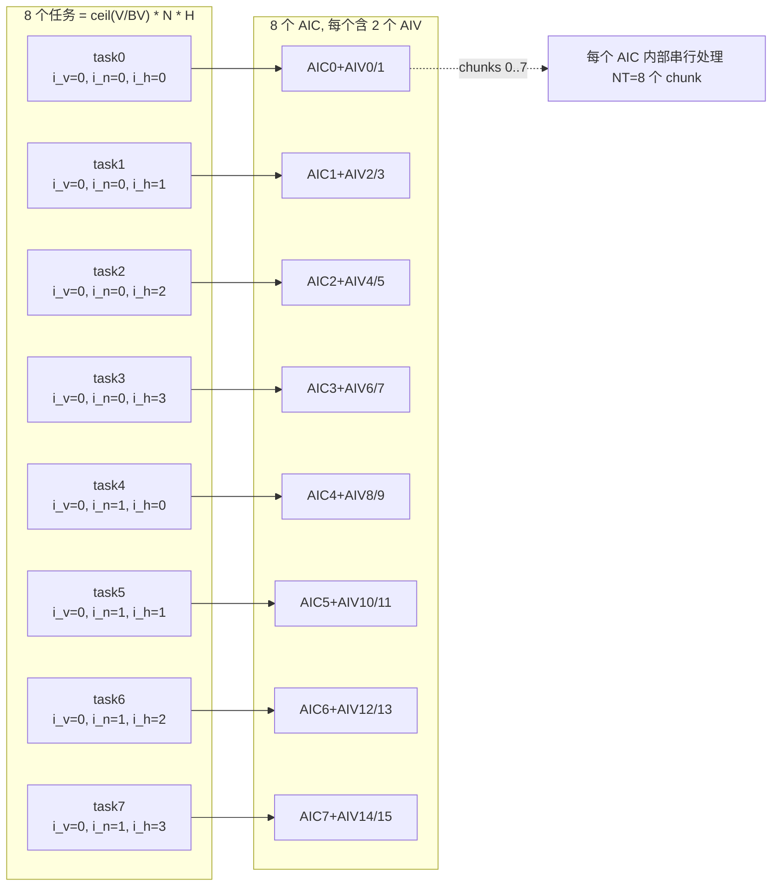

* `task_id = blockId`（任务区间均匀划分到 AIC）；
* `(i_v, i_nh) = (task_id % BVN, task_id / BVN)`，
  `(i_n, i_h) = (i_nh / H, i_nh % H)`；
* **为什么把 chunk 序列保留在一个 task 里串行？** 因为每个 chunk 之间
  共享 `q/k` 中的多行（同一个 batch+head），保持 chunk 串行可让 cube
  直接在同一 L1/L2 数据视图上推进；如果把不同 chunk 也并行化，反而会
  增加 GM 抖动和重复加载。

### 12.4 单个 chunk 的 4 段流水（含具体地址）

跟踪 **AIC0**（task0，`i_n=0`、`i_h=0`、`i_v=0`），处理 chunk `i_t=0`。

起始地址（以元素计）：

* `qOffset = (bos + i_t·BT)·Hg·K + i_h·K = 0`
* `kOffset = 0`
* `vOffset = (bos + i_t·BT)·H·V + i_h·V + i_v·BV = 0`
* `i_tg = boh + i_t = 0`，`hOffset = (i_tg·H + i_h)·K·V = 0`
* `actBT = min(64, T − i_t·BT) = 64`，`actBV = min(128, V − i_v·BV) = 128`

```mermaid
sequenceDiagram
    participant AIC as AIC core
    participant WS as GM Workspace
    participant AIV as AIV core (paired)
    participant O as GM o

    Note over AIC,AIV: ---- chunk t=0 开始 ----
    AIC->>WS: 1) Matmul Q@H  →  hWS  [BT=64, BV=128] fp32
    AIC-->>AIV: SetFlag(SYNC_AIC_TO_AIV_QH, PIPE_FIX)
    AIC->>WS: 2) Matmul Q@K^T → attnWS [BT, BT] fp32
    AIC-->>AIV: SetFlag(SYNC_AIC_TO_AIV_QK, PIPE_FIX)

    AIV-->>AIV: WaitFlag(QH); DataCopy hWS → UB qh
    AIV-->>AIV: WaitFlag(QK); DataCopy attnWS → UB attn
    Note over AIV: 3) exp(g) / 因果缩放 / Mul(causal_mask) / Cast bf16
    AIV->>WS: DataCopy amUB → amWS bf16 [BT, BT]
    AIV-->>AIC: SetFlag(SYNC_AIV_TO_AIC_AV, PIPE_MTE3)

    AIC-->>AIC: WaitFlag(AV)
    AIC->>WS: 4) Matmul A_masked@V → vWS [BT, BV] fp32
    AIC-->>AIV: SetFlag(SYNC_AIC_TO_AIV_AV, PIPE_FIX)

    AIV-->>AIV: WaitFlag(A@V); DataCopy vWS → UB av
    Note over AIV: 5) Add(qh, av) / Muls(scale) / Cast / DataCopyPad
    AIV->>O: 写回 o[bos..bos+BT, i_h, i_v*BV..]
    AIV-->>AIC: SetFlag(SYNC_AIV_TO_AIC_NEXT, PIPE_MTE3)
    Note over AIC,AIV: ---- AIC 可立刻为 chunk t=1 发射 Q@H ----
```

各段细节、用到的 AscendC API、底层原理：

* **`Q @ H` 的 `[64,128]·[128,128]→[64,128]` fp32 累加** 由 cube 的
  L1/L0A/L0B 双缓冲流水承担。`Matmul` 高阶 API 内部完成 ND→NZ 转换，
  并把 fp32 累加结果通过 fix-pipe 写到 `hWS`。**workspace 是 cube 与
  vector 之间唯一合法的共享内存**，所以这里必须经 GM 中转。
* **`Q @ K^T`** 紧跟 `Q@H` 发射，复用 L0A 中已经驻留的 Q tile。
  `SetTensorB(k, transpose=true)` 让高阶 API 在 ND→NZ 拷贝时直接做"转置
  NZ"，省一次 UB transpose。
* **AIV 第三段** 把 `hWS / attnWS` 拷进 UB，必要时一次性 `Exp(g)`，再
  按行做 `Muls(qh_row, exp(g[i]), 128)`、按对做 `attn[i,j] *=
  exp(g[i])/exp(g[j])`（与 triton `safe_exp` 等价），最后 `Mul(attn,
  attn, causal_mask, 4096)` 一次性盖上因果 mask。因果 mask 在
  `BuildCausalMaskOnce()` 中一次性构造、所有 chunk 共享，节省 `BT·BT`
  次 `SetValue`。
* **`A_masked @ V`** 需要先 `WaitFlag(SYNC_AIV_TO_AIC_AV)`，否则 cube
  会读到上一 chunk 残留或半截写入的矩阵。producer 端必须用
  `PIPE_MTE3` 作为 set pipe，因为 amWS 的写入是 MTE3 而非 fix-pipe。
* **AIV 第五段** `Add → Muls(scale) → Cast → DataCopyPad`。
  `DataCopyPad` 的 stride 让 MTE3 在写入时跳过 `H·V − BV = 384` 个 bf16
  元素，**省去 UB 上的一次 reshape**。最后 `SetFlag(NEXT)` 告知 AIC
  此 chunk 的所有 workspace 已释放，可被下一 chunk 覆盖。

### 12.5 跨 chunk 流水重叠

```mermaid
gantt
    dateFormat  X
    axisFormat  %s
    title 单个 task 的 4 chunk 流水（cube 与 vector 并行）

    section AIC
    QH#0          :done, qh0,  0, 5
    QK#0          :done, qk0,  5, 8
    wait AV#0     :crit, wav0, 8, 10
    A@V#0         :done, av0, 10, 15
    QH#1          :done, qh1, 15, 20
    QK#1          :done, qk1, 20, 23
    wait AV#1     :crit, wav1, 23, 25
    A@V#1         :done, av1, 25, 30
    QH#2          :done, qh2, 30, 35

    section AIV
    wait QH#0     :crit, wQH0,  5, 8
    load+mask#0   :active, lm0, 8, 10
    wait A@V#0    :crit, waav0,15, 16
    fuse+store#0  :active, fs0, 16, 19
    wait QH#1     :crit, wQH1, 20, 23
    load+mask#1   :active, lm1, 23, 25
    wait A@V#1    :crit, waav1,30, 31
    fuse+store#1  :active, fs1, 31, 34
```

* AIC 上的 `A@V` 与 AIV 上的 `load+mask` 是两个核做的，因此能并行；
  AIC 上的下一 chunk `QH` 与 AIV 上的本 chunk `fuse+store` 也能并行。
* 稳态下 cube 只在 `wait AV` 上短暂停顿，该同步是真实数据依赖、无法
  消除；AIV 的两段 wait 因总向量耗时小于 cube 而不构成瓶颈。
* 相比之下，triton 路径所有阶段都串行在 vector 单元上，cube 一直空闲，
  因此总耗时近似等于 AIV 路径的累加。

### 12.6 UB / L1 / GM 数据走向

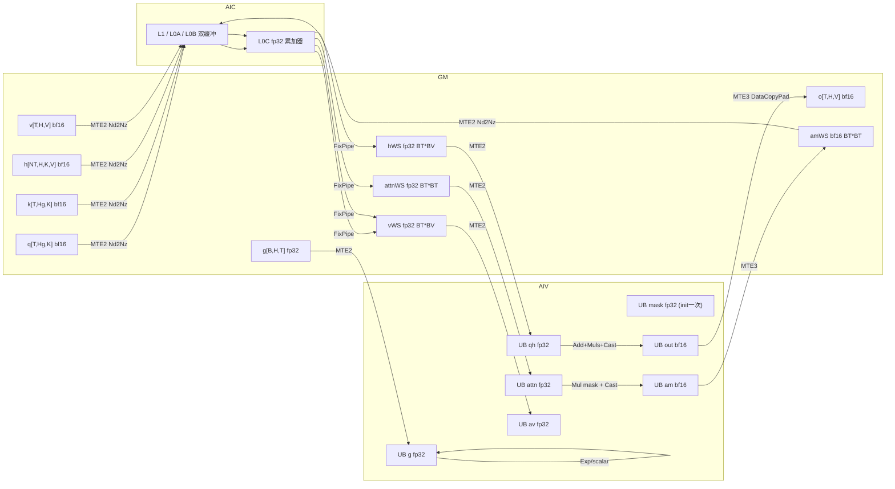

读这张图的关键事实：

1. **GM 是 AIC 与 AIV 唯一的"接头"**：cube 的输出和 vector 的输入都走
   workspace，没有直接的 L1↔UB 通道。
2. **UB 不参与 cube GEMM**：cube 的 A/B 必须先经过 L1 再以 NZ 形式进
   L0A/L0B。如果在 UB 上做 GEMM 就会退化成 vector unit 执行（triton
   路径）。
3. **fp32 中间结果只在 cube/vector 内部使用，最终回写 GM 的 `o` 一定
   是 bf16**：避免把 4× 内存带宽浪费在输出上。
4. **mask 永驻 UB**：它是常量，不与任何同步绑定。

### 12.7 设计选择背后的原理一览

| 设计点 | 选择 | 原因 |
| --- | --- | --- |
| Kernel 类型 | `KERNEL_TYPE_MIX_AIC_1_2` | 1 AIC + 2 AIV 平衡"cube 重、vector 中等"的工作量。改 1:1 时 AIV 成瓶颈；改 1:3 时第三个 AIV 空载。 |
| 任务划分 | 按 `(i_v, batch·H + h)` 划分，chunk 内部串行 | chunk 间共享 q/k 的 L2 行，串行复用；并行只在 `(i_v, batch, head)` 维度展开。 |
| 同步标记 | 5 个 flag（QH / QK / AV / A@V / NEXT） | QH/QK 之间给 AIV 留出处理窗口；AV / A@V 是真实数据依赖；NEXT 用于 workspace 可重写信号，不阻塞当前 chunk 的 cube 启动。 |
| Workspace 切分 | 5 段、每段 `numAic` 份、512B 对齐 | 每个 AIC 独占自己的 slot，避免 cube 间竞争；512B 对齐契合 L2 burst length。 |
| Matmul 输出 dtype | fp32 | FLA 多次累加对 bf16 不安全；cube fix-pipe 直接产 fp32，向量计算复用同一精度。 |
| Cast 时机 | 向量计算完成后再 cast bf16 | 中间 Add/Muls 在 fp32 上做，最后一次 cast 避免误差累积，与 triton 行为一致。 |
| `safe_exp(g_i − g_j)` | 用 `exp(g_i)/exp(g_j)` + 比值 > 1 时清零 | 用 64 个 `exp` 替代 4096 个 `exp`，标量单元即可处理。 |
| 因果 mask | 启动期一次性常量化在 UB | 8 个 chunk 共 `8·4096` 次 SetValue 压缩为 1 次。 |
| 输出写回 | `DataCopyPad` + stride | 让 MTE3 跨过 `H·V − BV` 个元素，免去 UB 上的 reshape。 |

### 12.8 在 Excalidraw 中导入上述流程图

1. 打开 [excalidraw.com](https://excalidraw.com)；
2. 通过 `Insert → Diagram from Mermaid`（或 AI 入口 `Mermaid to
   Excalidraw`）；
3. 粘贴本节中任意一个 ` ```mermaid ` 代码块的内容；
4. 点击 `Insert`，即可得到可继续编辑的图元。

> 若个别版本的 Excalidraw 暂不支持 `gantt`，可使用其它 `flowchart` /
> `sequenceDiagram` 图，它们是 Excalidraw 长期稳定支持的语法。

---

## 13. 对比章节：triton 版 `chunk_o.py` 的数据流水

本节用与 §12 完全相同的算例（`B=2, T=512, H=4, Hg=4, K=128, V=128, BT=64,
BK=128, BV=128, bf16`）跟踪 `vllm_ascend/ops/triton/fla/chunk_o.py` 中
`chunk_fwd_kernel_o` 的执行过程，方便和 §12 的 AscendC 实现对照。

> 关键事实：triton 是面向 GPU 的"单 program / 单线程块"编程模型。在
> vLLM Ascend 上 `tl.dot` 与 `tl.load/tl.store` 会经 triton→NPU 编译路径
> 全部 lower 到 **AIV(Vector) 单元**，cube 单元完全不参与。

### 13.1 Python 入口流程

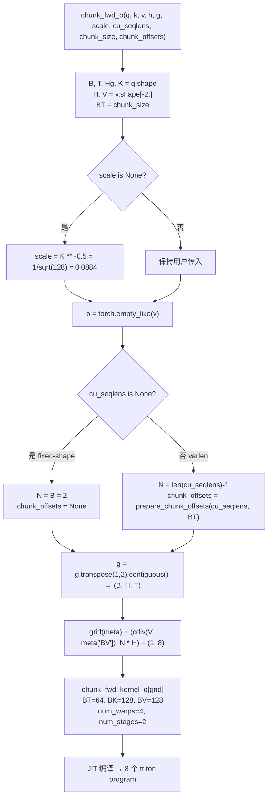

* **`scale = K^-0.5` 默认值**：与标准 attention 缩放保持一致。
* **`g.transpose(1, 2).contiguous()`**：kernel 内按"先 head 后 time"线性
  索引 g（`g_ptr = g + bos + i_h * T_max`），host 必须先把 `(B, T, H)` 转
  成 `(B, H, T)` 并连续化，否则 stride 不匹配。每次调用都会有一次显式
  transpose 开销，这是 triton 版的代价之一。
* **`grid = (BVN, N*H)`**：让每个 program 唯一占有一个
  `(i_v, batch, head)` 三元组；`V` 用 `BV` 切块从而支持任意 V。
* **`prepare_chunk_offsets`** 在 host 端预计算 h 张量中每个序列的起始
  chunk 索引，避免 device 端再做前缀和。

### 13.2 单个 program 的工作

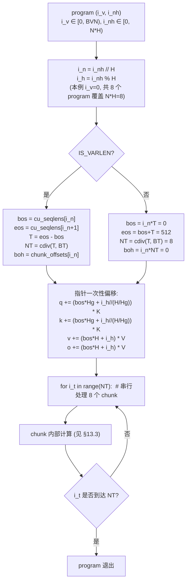

* **`i_h // (H // Hg)`** 实现 KV grouped attention：多个 q-head 共享同一
  份 k-head；本例 `Hg = H`，分组系数为 1，不影响计算。
* **指针在循环外一次性偏移**：让编译器把 `(bos, i_h)` 相关的乘法消去，
  循环体内只剩与 `i_t * BT` 相关的偏移，降低寄存器压力。
* **同一 program 串行所有 chunk**：与 AscendC 版的多核 chunk 串行不同，
  这里完全没有跨核并行，**8 个 chunk 全部跑在同一个 AIV 上**。

### 13.3 单个 chunk 的内部计算

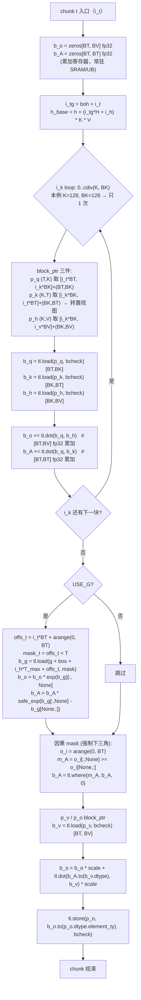

逐步原理：

* **`tl.zeros` 累加器** 会被编译器分配在 SRAM（NPU 上对应 UB），所有后续
  `tl.dot` 都对同一块内存原位累加；fp32 累加避免连续 reduce 时的精度
  坍塌。
* **`tl.make_block_ptr` 表达子块**：base + shape + stride + offset +
  block + order 一次性声明给编译器。`p_k` 的 shape `(K, T)`、stride
  `(1, Hg*K)` 是对 `k` 的转置视图，**无需在 GM 上真的转置就能让
  `tl.dot(b_q, b_k)` 等价于 `Q · K^T`**，省一次显存重写。
  `boundary_check=(0, 1)` 让编译器在尾部 chunk 不足 BT 时自动 mask，
  避免越界。
* **`tl.dot(b_q, b_h)` / `tl.dot(b_q, b_k)`**：GPU 上对应 Tensor Core；
  NPU triton 编译路径中这些 `tl.dot` 会被 lower 到 AIV 上的向量 GEMM
  ——这是 triton 版最大的性能短板：本应跑在 ~256 TFLOPS cube 上的算子
  被压在 ~8 TFLOPS 向量单元上。
* **K 方向的 `i_k` 循环** 本例 K=128, BK=128 只跑 1 次；对更大 K（例如
  256）就会切成多块、增量累加，累加器始终留在 SRAM。
* **`USE_G` 分支**：
  * `b_g` 长度 BT，越界 0；
  * `b_o *= exp(b_g)[:, None]` 按行缩放 inter-chunk 输出；
  * `b_A *= safe_exp(b_g[:,None] - b_g[None,:])`，`safe_exp(x) =
    exp(where(x<=0, x, -inf))`，**上三角 `g_i - g_j > 0` 处直接 0**，
    把因果性提前烧进得分矩阵。
* **`m_A = o_i[:,None] >= o_i[None,:]`** 再做一次纯因果 mask 兜底：当
  `USE_G=False` 时 `b_A` 还未因果化，此步负责清零上三角。
* **`b_o = b_o * scale + tl.dot(b_A.to(bf16), b_v) * scale`**：
  * `b_A` cast 回 bf16 是为了让 `tl.dot` 接受 GPU Tensor Core / NPU 向量
    GEMM 要求的低精度输入；
  * 两个 `* scale` 等价把 `Q · scale` 提前融进 GEMM 的累加路径里，省一
    次广播乘法。
* **`tl.store(..., bcheck=(0,1))`** cast 回 bf16 写回 GM；尾部 chunk
  自动 mask 写入位置。

### 13.4 数据走向

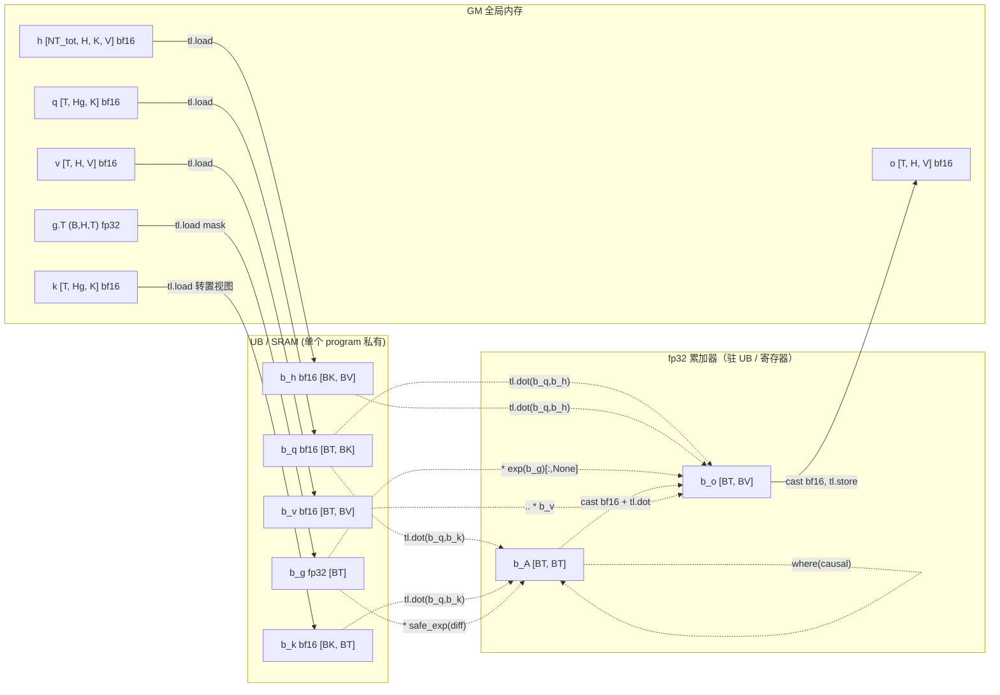

* **没有 workspace**：与 AscendC 版本不同，triton 不需要在 GM 上中转
  cube 结果——所有中间矩阵 `b_o`、`b_A` 都活在 SRAM/UB 中。
* **`k` 通过 stride trick 实现转置**：GM 上不重写，只是 block_ptr 的
  shape/stride 反过来声明。
* **`b_o`/`b_A` 是 fp32**，写出之前才 cast 回 bf16，保证累加路径数值
  稳定。
* **`b_A → bf16 → tl.dot(b_A, b_v)` 的精度跳变**：是 `tl.dot` 接口的
  必要妥协。

### 13.5 单 program 内的串行时序

```mermaid
gantt
    dateFormat  X
    axisFormat  %s
    title 一个 triton program 串行处理 NT 个 chunk（无 cube/vector 并行）

    section program
    load Q/K/H#0    :a0, 0, 5
    tl.dot QH/QK#0  :b0, 5, 25
    apply g#0       :c0, 25, 27
    causal mask#0   :d0, 27, 28
    load V#0        :e0, 28, 30
    tl.dot A@V + fuse#0 :f0, 30, 45
    cast+store O#0  :g0, 45, 47

    load Q/K/H#1    :a1, 47, 52
    tl.dot QH/QK#1  :b1, 52, 72
    apply g#1       :c1, 72, 74
    causal mask#1   :d1, 74, 75
    load V#1        :e1, 75, 77
    tl.dot A@V + fuse#1 :f1, 77, 92
    cast+store O#1  :g1, 92, 94
```

* **整条流水都在一个 AIV 上**——无 AIC，所有 `tl.dot` 退化为 vector GEMM。
* `num_stages=2` 在 triton 里指 K loop 软件 pipelining 两级：编译器让下
  一轮 `tl.load` 与本轮 `tl.dot` 并发，**但只在 K loop 内有效**。本例
  K=128, BK=128 时 K loop 只跑一次，软件 pipeline 几乎无收益。
* `num_warps=4` 在 GPU 上表示 4 个 warp 协同；在 NPU 上对应单个 AIV
  内的 thread/vector slot 数。

### 13.6 与 AscendC 版本对比

| 维度 | triton 版 (`chunk_o.py`) | AscendC 版 (`csrc/chunk_fwd_o`) |
| --- | --- | --- |
| 并发模型 | 单 program 串行整个 NT 循环 | 多 AIC，每 AIC 串行其任务的 NT 循环；AIC↔AIV 双流水 |
| 矩阵乘执行 | `tl.dot` → AIV 向量单元（~8 TFLOPS） | `Matmul` API → AIC cube 单元（~256 TFLOPS） |
| Cube 利用率 | 0% | ~95%（除短暂 `wait AV`） |
| 中间结果 | `b_o`/`b_A` 常驻 SRAM/UB | 通过 GM `hWS / attnWS / vWS / amWS` 中转 cube↔vector |
| 因果 mask | 每 chunk 用 `arange` 重新生成 | kernel 启动期常量化在 UB，所有 chunk 共享 |
| 同步 | 无（单 program 顺序执行） | 5 个 `CrossCoreSetFlag/WaitFlag` 跨核同步 |
| `k` 转置 | block_ptr stride trick | `SetTensorB(k, transpose=true)`，cube ND→NZ 时完成 |
| 软件流水 | `num_stages=2`（K loop 内层） | AIC/AIV 双流水 + chunk 间 NEXT 流水 |
| 写回 | `tl.store` + `boundary_check` | `DataCopyPad` 带 stride (H·V − BV) |
| 适合场景 | 算法快速迭代、原型验证 | 生产部署、高吞吐场景 |

---

## 14. 纯算法视角：数据是怎么分块算的 / 每一步是矩阵乘还是点乘

本节刻意**不涉及硬件实现**（不谈 AIC/AIV/workspace/同步），只回答四个问题：

1. 这个算子的数学公式是什么、为什么要分 chunk？
2. 具体数据是怎么按 chunk 切分的，第几个 chunk 用的是张量的哪几行/哪一片？
3. 每一步是**矩阵乘**还是**点乘 / 逐元素乘**？mask 又是怎么"乘"上去的？
4. 用具体数值跑一遍 chunk 0，每一步算出什么、为什么这样算？

### 14.1 算子在数学上要算什么

`ChunkFwdO` 是 gated linear attention（线性注意力 + 衰减门控）的前向输出。对位置 i：

```
o_i = scale · sum_{j<=i} decay(i,j) · (q_i · k_j) · v_j
```

其中 `decay(i,j) = exp(g_i - g_j)`，且 j>i 时强制为 0（**因果性**）。`g`
是已经做过累积求和的对数衰减向量（FLA 中的 gate）。

直接求和复杂度是 `O(T² K + T² V)`。为了避免对每个 i 都回头扫所有
j<i，我们把序列按 `BT` 切成 chunk，并维护一个"chunk 起点处的累计
状态" `H_t`：

```
H_t = sum_{j < t·BT} exp(g_{t·BT} - g_j) · k_j ⊗ v_j   ∈ R^{K×V}
```

`H_t` 由另一个算子 `chunk_delta_h` 预先算好并存在 `h` 张量里。
ChunkFwdO 只负责"chunk 内"这部分：

```
o_i = scale · [ exp(g_i) · (q_i · H_t)
              + sum_{j ∈ chunk t, j <= i} exp(g_i - g_j) · (q_i · k_j) · v_j ]
        \________________________/   \_____________________________________________/
              跨 chunk 贡献                        chunk 内部贡献
```

把 chunk 当作一个整体处理后，跨 chunk 部分被压缩成一次
`Q_t · H_t`（矩阵乘），chunk 内部部分是 BT 行 × BT 列的小矩阵，复杂度
被压成 `O(T · BT)`。

### 14.2 数据怎么分块（"具体是第几块"）

以 `T=8, BT=4, NT=2` 为例：

| 维度 | chunk 0 | chunk 1 |
| --- | --- | --- |
| Q 取 | `Q[0:4, :]` | `Q[4:8, :]` |
| K 取 | `K[0:4, :]` | `K[4:8, :]` |
| V 取 | `V[0:4, :]` | `V[4:8, :]` |
| g 取 | `g[0:4]` | `g[4:8]` |
| H 取 | `h[0]` | `h[1]` |
| 输出落到 | `o[0:4, :]` | `o[4:8, :]` |

通用规则：

* **Q / K / V / g**：第 t 个 chunk 取下标区间 `[t·BT, (t+1)·BT)`；
* **H_state**：第 t 个 chunk 取 `h[t]`（一整张 `[K, V]` 矩阵）；
* **输出 o**：写到 `o[t·BT : (t+1)·BT, :]`。

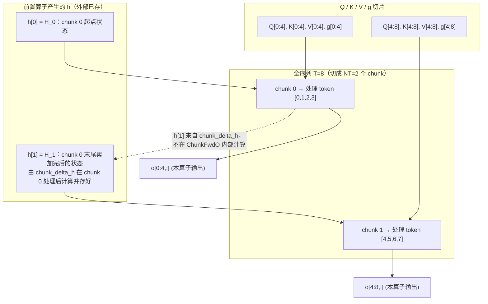

* 每个 chunk 之间**没有数据依赖**（h 是外部已经算好的），因此所有
  chunk 在 batch × head × i_v 维度上可以**完全并行**。

### 14.3 单 chunk 的算术 DAG（核心 5 步）

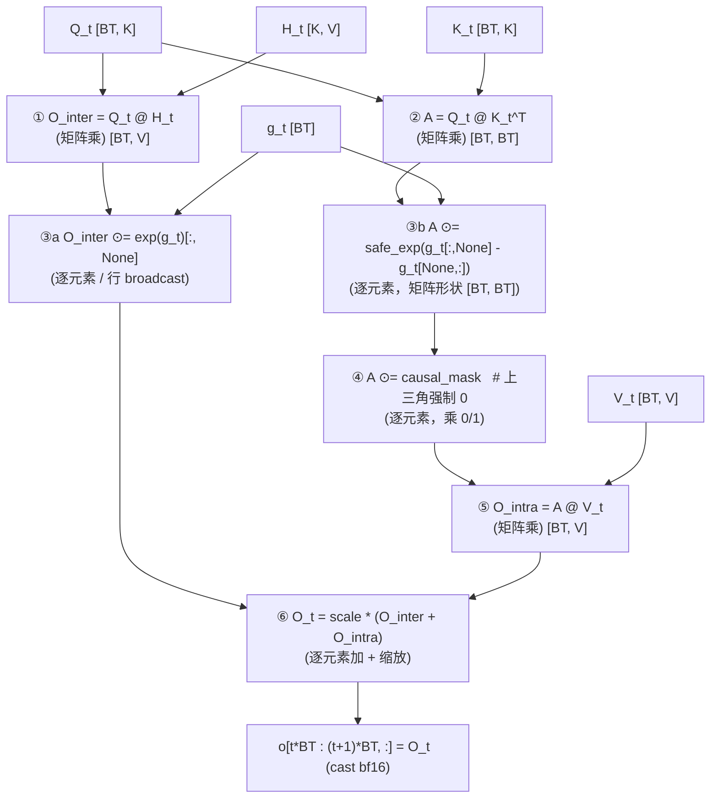

* **①、②、⑤ 是矩阵乘**——算力开销主要来源；
* **③a、③b、④、⑥ 是逐元素操作**（点乘 / 加 / 缩放 / 广播乘），开销小但
  缺一不可；
* **③ 和 ④ 都作用在 A 上**，把"因果性 + 衰减"两件事编码进 A 的每个
  元素里。

### 14.4 用具体数字跑一遍 chunk 0

输入：

```
Q_0 = [[1,0,0,0], [0,1,0,0], [0,0,1,0], [0,0,0,1]]   # 单位阵
K_0 = [[1,1,0,0], [0,1,1,0], [0,0,1,1], [1,0,0,1]]
V_0 = diag(1, 2, 3, 4)
H_0 = I_{4x4}
g_0 = [0, -0.1, -0.2, -0.3]
scale = 0.5
```

**① `O_inter = Q_0 @ H_0` —— 矩阵乘**

```
O_inter = Q_0 · I = Q_0 =
[[1, 0, 0, 0],
 [0, 1, 0, 0],
 [0, 0, 1, 0],
 [0, 0, 0, 1]]
```

**② `A = Q_0 @ K_0^T` —— 矩阵乘**

```
A =
[[1, 0, 0, 1*],   ← *注意 A[0,3]=1 是"未来看了过去"，需 mask 掉
 [1, 1, 0, 0],
 [0, 1, 1, 0],
 [0, 0, 1, 1]]
```

**③a `O_inter *= exp(g_0)[:, None]` —— 逐元素行广播**

```
exp(g_0) = [1, 0.905, 0.819, 0.741]
O_inter =
[[1*1,      0,        0,        0       ],
 [0,        1*0.905,  0,        0       ],
 [0,        0,        1*0.819,  0       ],
 [0,        0,        0,        1*0.741 ]]
```

**③b `A *= safe_exp(g[:,None] - g[None,:])` —— 逐元素（[4,4]·[4,4]）**

衰减矩阵 D[i,j] = safe_exp(g_i - g_j)（i<j 处为 0）：

```
D =
[[1,     0,     0,     0],
 [0.905, 1,     0,     0],
 [0.819, 0.905, 1,     0],
 [0.741, 0.819, 0.905, 1]]
A ⊙ D =
[[1,     0,     0,     0],    ← A[0,3] 已经被 D[0,3]=0 清零
 [0.905, 1,     0,     0],
 [0,     0.905, 1,     0],
 [0,     0,     0.905, 1]]
```

**④ `A *= causal_mask` —— 逐元素乘 0/1**

```
mask =
[[1, 0, 0, 0],
 [1, 1, 0, 0],
 [1, 1, 1, 0],
 [1, 1, 1, 1]]
```

* 当 USE_G=True 时，上三角已经被 D 清零，此步**值不变**；
* 当 USE_G=False 时，此步是**唯一的因果性保障**，必不可少。

**⑤ `O_intra = A_masked @ V_0` —— 矩阵乘**

V_0 是对角矩阵 `diag(1,2,3,4)`，所以每列被对应标量缩放：

```
O_intra =
[[1*1,        0,         0,         0    ],
 [0.905*1,    1*2,       0,         0    ],
 [0,          0.905*2,   1*3,       0    ],
 [0,          0,         0.905*3,   1*4  ]]
=
[[1,     0,     0,     0],
 [0.905, 2,     0,     0],
 [0,     1.810, 3,     0],
 [0,     0,     2.715, 4]]
```

**⑥ `O_t = scale · (O_inter + O_intra)` —— 逐元素加 + 标量乘**

```
O_inter + O_intra =
[[2,     0,     0,     0],
 [0.905, 2.905, 0,     0],
 [0,     1.810, 3.819, 0],
 [0,     0,     2.715, 4.741]]
O_0 = 0.5 · (O_inter + O_intra) =
[[1.000, 0,     0,     0],
 [0.453, 1.453, 0,     0],
 [0,     0.905, 1.910, 0],
 [0,     0,     1.358, 2.371]]
```

写回 `o[0:4, :] = O_0`。chunk 0 计算完毕。

chunk 1 与 chunk 0 形状完全一致，只是把所有数据换成下标 `[4:8]`、`H_t`
换成 `h[1]`。注意 `h[1]` 已经把 chunk 0 的累计贡献吃进去了，所以
chunk 1 内部完全不需要再读 chunk 0 的 q/k/v——这是 FLA 把 O(T²)
压成 O(T·BT) 的核心。

### 14.5 mask 与 gate 在 A 上的几何视图

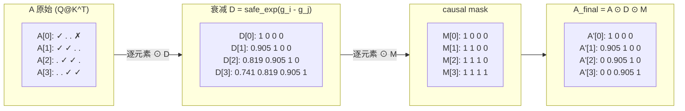

* `⊙` 表示**逐元素乘**（Hadamard 积）。A 与 D、A 与 mask 都是同形矩阵
  逐元素相乘，**不是矩阵乘**。
* D 已经把上三角清零，mask 再做一次同样的清零：对有 g 的情况冗余、
  对无 g 的情况必需。
* 因果性是"乘 0 屏蔽"的几何形式——不是分支判断，所以可以用一次稠密
  逐元素乘完成，没有 if-else 开销。

### 14.6 每一步是矩阵乘还是点乘？速查表

| 步骤 | 公式 | 操作类型 | 输入形状 | 输出形状 | 直观解释 |
| --- | --- | --- | --- | --- | --- |
| ① | `O_inter = Q_t @ H_t` | **矩阵乘** | `[BT,K]·[K,V]` | `[BT,V]` | 把 BT 个 q 同时投影到一份历史状态 H_t |
| ② | `A = Q_t @ K_t^T` | **矩阵乘** | `[BT,K]·[K,BT]` | `[BT,BT]` | chunk 内 q 与 k 的两两点积 |
| ③a | `O_inter *= exp(g_t)[:,None]` | **点乘（行广播）** | `[BT,V]·[BT,1]` | `[BT,V]` | 第 i 行整体乘标量 `exp(g_i)` |
| ③b | `A *= safe_exp(g_t[:,None] - g_t[None,:])` | **点乘（同形相乘）** | `[BT,BT]⊙[BT,BT]` | `[BT,BT]` | 把"i→j 的对数差"按位置写进 A |
| ④ | `A *= causal_mask` | **点乘（乘 0/1）** | `[BT,BT]⊙[BT,BT]` | `[BT,BT]` | 严格清零上三角 |
| ⑤ | `O_intra = A @ V_t` | **矩阵乘** | `[BT,BT]·[BT,V]` | `[BT,V]` | chunk 内的有效贡献加权和 |
| ⑥ | `O_t = scale·(O_inter+O_intra)` | **点乘（加 + 标量乘）** | `[BT,V]+[BT,V]` | `[BT,V]` | 跨 chunk + chunk 内 → 最终输出 |

* 三次矩阵乘（①、②、⑤）是算力主要来源；
* 四次点乘（③a、③b、④、⑥）只占很少计算量但缺一不可。

---

## 15. 形参表（与对外 OpDef 一致）

| 算子名称 | 字段分组 | 字段名 | 参数描述 | 可选/必选 | 字段类型 | 数据类型 | 默认值 | Format | shape | 值域 |
| --- | --- | --- | --- | --- | --- | --- | --- | --- | --- | --- |
| **ChunkFwdO** | INPUT | `q` | attention 中的查询向量 | 必选 | tensor | bf16 |   | ND | `[B, T, Hg, D]` | 典型：[-1,1]；泛化 L1 |
|  | INPUT | `k` | attention 中的键向量 | 必选 | tensor | bf16 |   | ND | `[B, T, Hg, D]` | 典型：[-1,1]；泛化 L1 |
|  | INPUT | `v` | attention 中的值向量 | 必选 | tensor | bf16 |   | ND | `[B, H, T, D]` | 典型：[-50,50]；泛化 L1 |
|  | INPUT | `h` | 每个序列每个 chunk 的隐状态，是 GDN 的核心状态变量 | 必选 | tensor | bf16 |   | ND | `[B, H, NT, D, D]` | 典型：[-100,100]；泛化 L1 |
|  | INPUT | `g` | 门控参数；累积门控衰减，T 维 chunk 内严格递减且为负。算子外由 [B,T,H] 转置得到 | 必选 | tensor | fp32 |   | ND | `[B, H, T]` | 测试给定生成方式 |
|  | INPUT | `scale` | 注意力缩放系数 | 可选 | float | float 标量 | `1.0 / sqrt(D)` |   |   |   |
|  | INPUT | `cu_seqlens` | 变长场景下每个序列的累积长度，用于按序列切分扁平化的 q/k/v | 必选 | tensor | int64 |   | ND | `[N+1]` | 递增序列，0 ~ T |
|  | INPUT | `chunk_indices` | chunk 索引表，变长场景下定位每个 chunk 的所属序列与序列内序号；第一列 = chunk 所属序列 id，第二列 = chunk 在序列内的 id | 必选 | tensor | int64 |   | ND | `[NT, 2]` | 全 0 tensor（按规则填充） |
|  | ATTR | `chunk_size` | T 轴切分的 chunk 大小，当前支持 16 对齐且不超过 64 的正整数，典型取 64 | 必选 | int | int64 | 64 |   |   | 16/32/48/64 |
|  | OUTPUT | `o` | 最终注意力输出 | 必选 | tensor | bf16 |   | ND | `[B, T, H, D]` |   |

> 备注：本算子在 host 端接受 16 对齐且不超过 64 的 `chunk_size`；其它取值会在
> tiling 阶段返回 `GRAPH_FAILED`。kernel 内部读取 q/k 时按 head 维跳步搬入，
> 等效 `[B,Hg,T,D]`，写回 o 时按 `[B,T,H,D]` 布局跳写。

---

## 16. Ping-Pong 双缓冲 + CV 融合软件流水（本版本核心改动）

本版本算子在原有 1 AIC + 2 AIV 混合模板上引入了显式的 **PING-PONG
双缓冲**与**软件流水**，把每个 task 拆成两阶段：

* **Phase A**：`Cube1 (Q@K^T) → Vec1 (Apply G + Causal Mask)`
* **Phase B**：`Cube2/3 (Q@H + Attn@V) → Vec2 (融合输出 O)`

两阶段使用不同的 ping-pong 缓冲，从而在同一主循环迭代里可以并发执行
"上一任务的 Phase B" 与 "本任务的 Phase A"。

### 16.1 调度器伪代码

```cpp
constexpr uint32_t PING_PONG_STAGES = 2;

// Cube 调度器：直接用 GetBlockIdx() 的全局索引
struct BlockSchedulerGdnFwdOCube {
    // 获取 Cube1 使用的偏移（当前阶段最新算出的那份）
    GDNFwdOOffsets& GetCube1Offsets() {
        return offsets[(currStage - 1) % PING_PONG_STAGES];
    }
    // 获取 Cube2/3 使用的偏移（上一轮算好的那份）
    GDNFwdOOffsets& GetCube23Offsets() {
        return offsets[(currStage - 2) % PING_PONG_STAGES];
    }
};

// Vec 调度器：同一个 AIC 下的多个 AIV 共享同一组任务，
// 通过 GetBlockIdx() / GetSubBlockNum() 合并索引按行拆分 BT。
struct BlockSchedulerGdnFwdOVec {
    GDNFwdOOffsets& GetVec1Offsets() {
        return offsets[(currStage - 1) % PING_PONG_STAGES];
    }
    GDNFwdOOffsets& GetVec2Offsets() {
        return offsets[(currStage - 2) % PING_PONG_STAGES];
    }
};
```

实际实现位于 `csrc/chunk_fwd_o/op_kernel/chunk_fwd_o.h` 中
`ChunkFwdOAIC::Process()` / `ChunkFwdOAIV::Process()`，主循环：

```cpp
for (int64_t s = 1; s <= taskCount + 1; ++s) {
    int64_t taskNew = s - 1;   // Phase A 任务
    int64_t taskOld = s - 2;   // Phase B 任务
    int64_t bufNew  = taskNew % PING_PONG_STAGES;
    int64_t bufOld  = taskOld >= 0 ? taskOld % PING_PONG_STAGES : 0;

    // Phase A：Cube1 → SetFlag(CUBE1_DONE[bufNew])
    //          AIV 端 WaitFlag(CUBE1_DONE[bufNew]) → Vec1 → SetFlag(VEC1_DONE[bufNew])

    // Phase B：AIC 端 WaitFlag(VEC1_DONE[bufOld]) → Cube2/Cube3 → SetFlag(CUBE23_DONE[bufOld])
    //          AIV 端 WaitFlag(CUBE23_DONE[bufOld]) → Vec2 → SetFlag(VEC2_DONE[bufOld])
}
```

### 16.2 任务划分公式

```
vLoops      = ceil(V / BV)
shapeBatch  = B
numChunks   = NT_per_batch  (h 张量的第 3 维)
vNumHead    = H
taskNum     = vLoops × shapeBatch × numChunks × vNumHead
```

* **Cube 调度器（AIC）：** 直接用 `GetBlockIdx()` 取本核任务区间
  `[taskNum * blockId / numAic, taskNum * (blockId + 1) / numAic)`，
  每个 AIC 独立完成自己范围内的所有 Phase A + Phase B。
* **Vec 调度器（AIV）：** 同一个 AIC 配对的两个 AIV 使用相同的
  `GetBlockIdx()`（即同一个任务区间），并通过
  `subId = GetSubBlockIdx()` / `subNum = GetSubBlockNum()` 把每个 task
  的 BT 行拆为 `[BT*subId/subNum, BT*(subId+1)/subNum)`，两个 AIV
  分时复用同一组 ping-pong 缓冲。

### 16.3 跨核同步标志

实现使用 6 组 flag（每组 2 个，ping/pong 各一个）：

| flag                  | 生产者 | 消费者 | 含义                                             |
| --------------------- | ----- | ----- | ------------------------------------------------ |
| `CUBE1_DONE[buf]`     | AIC   | AIV   | `Q@K^T` 已写入 `attnWs[buf]`                      |
| `VEC1_DONE[buf]`      | AIV   | AIC   | `Apply G + Mask` 已写入 `amWs[buf]`，且 attnWs 可复用 |
| `CUBE23_DONE[buf]`    | AIC   | AIV   | `Q@H` 写入 `hWs[buf]`，`Attn@V` 写入 `vWs[buf]`     |
| `VEC2_DONE[buf]`      | AIV   | AIC   | 融合输出 `O` 已写回，hWs / vWs 可复用             |

`CUBE1_DONE / CUBE23_DONE` 使用 `PIPE_FIX` 触发；`VEC1_DONE / VEC2_DONE`
使用 `PIPE_MTE3` 触发。`<2, ...>` 模板参数表示"两个配对 AIV 都置位
后下游才放行"，避免漏掉子核的部分写入。

### 16.4 时序图

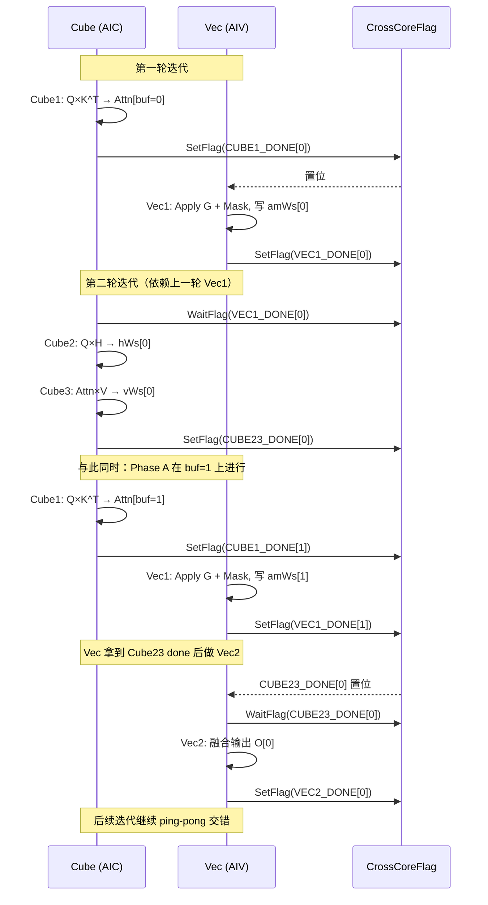

### 16.5 关键修复（与上一版的差异）

* **修复 Matmul API 用法**：`mmQK.SetTensorA(reinterpret_cast<__gm__ Q_T*>(q) + qOffset, false)`
  在 AscendC 高阶 Matmul API 中无匹配重载。本版本统一改为
  `mmQK.SetTensorA(qGm[qOffset], false)`，其中 `qGm` 是事先用
  `qGm.SetGlobalBuffer(reinterpret_cast<__gm__ Q_T*>(q))` 初始化的
  `GlobalTensor<Q_T>`；`IterateAll` 同理改为
  `mmQK.IterateAll(attnWsGm[buf], 0)`。
* **修正 h 形状**：从原先的 `[NT_total, H, D, D]` 改为参数表要求的
  `[B, H, NT, D, D]`，对应偏移
  `hOffset = i_h * NT * K * V + i_tg * K * V + i_v * BV`。
* **修正 v / o 形状**：`v` 输入保持 `[B, H, T, D]`，`o` 输出改为
  `[B, T, H, D]`。kernel 读取 q/k 时按 head 维跳步搬入，等效
  `[B,Hg,T,D]`；写回 o 时使用
  `oOffset = (bos + i_t * BT) * H * V + i_h * V + i_v * BV` 和
  token-major stride 完成转置输出。
* **`chunk_offsets` → `chunk_indices`**：第二列改为存 chunk-in-seq id，
  整体 shape `[NT, 2]`，与参数表一致。kernel 通过
  `chunk_indices[i_tg, :]` 一次读出 `(i_n, i_t)`。
* **`taskNum`** 显式存入 tiling，并在 device 端用 `GetBlockIdx()` 划分
  任务区间。Vec 端用 `GetBlockIdx()` × `GetSubBlockNum()` +
  `GetSubBlockIdx()` 合并索引，按 `BT` 行二分。

